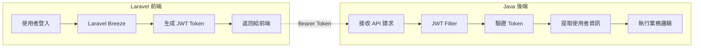
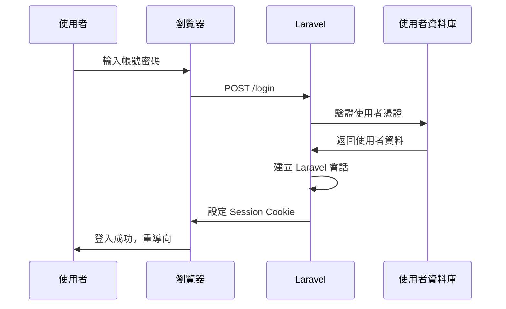
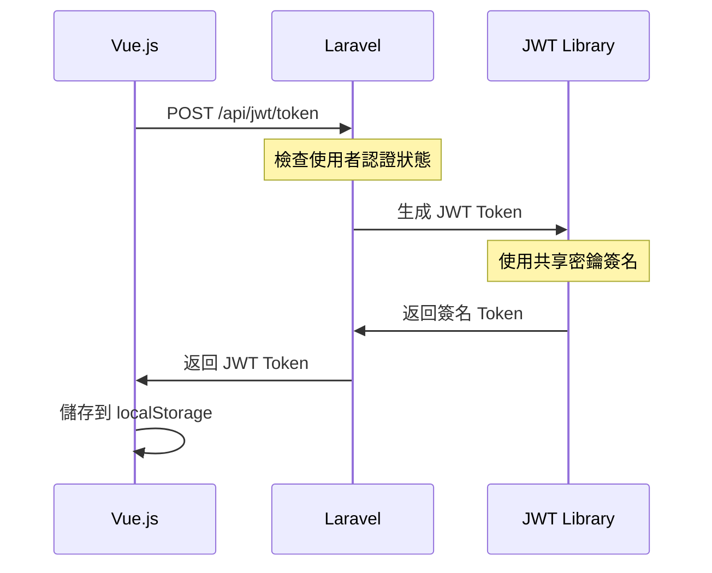
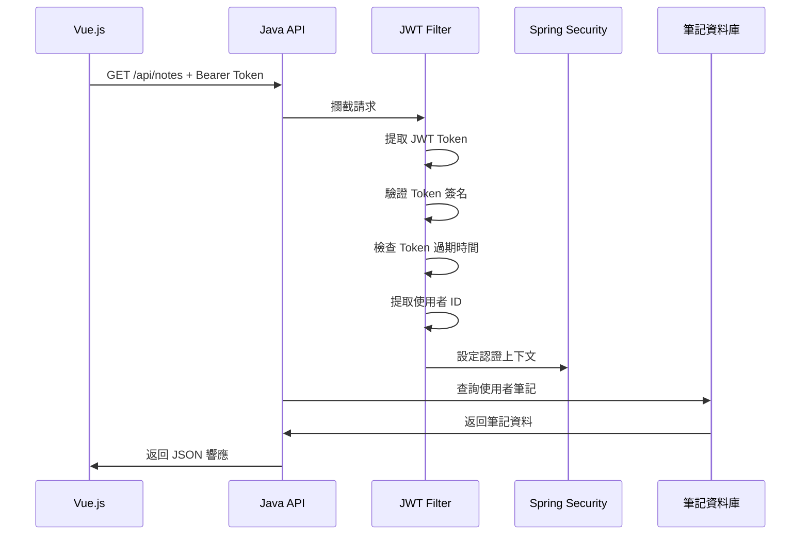

# 🔐 JWT 認證流程文檔

Coffee Journal 系統中 JWT Token 的完整認證流程說明。

## 📋 認證架構概覽



## 🔄 完整認證流程

### 1. 使用者登入階段



### 2. JWT Token 生成階段



### 3. API 調用階段



## 🔧 技術實現細節

### Laravel JWT Token 生成

**JwtController.php**:
```php
public function generateToken(Request $request)
{
    $user = Auth::user();
    
    $payload = [
        'iss' => config('app.url'),           // 簽發者
        'aud' => 'coffeenote-api',            // 接收者  
        'iat' => time(),                      // 簽發時間
        'exp' => time() + (24 * 60 * 60),     // 過期時間（24小時）
        'sub' => $user->email,                // 主題（使用者識別）
        'userId' => $user->id,                // 使用者 ID
        'email' => $user->email,              // 使用者 Email
        'name' => $user->name                 // 使用者名稱
    ];
    
    $token = JWT::encode($payload, $this->jwtSecret, 'HS256');
    
    return response()->json([
        'token' => $token,
        'type' => 'Bearer',
        'expires_in' => 86400
    ]);
}
```

### Java JWT Token 驗證

**JwtAuthenticationFilter.java**:
```java
@Override
protected void doFilterInternal(HttpServletRequest request, 
                               HttpServletResponse response, 
                               FilterChain filterChain) {
    
    // 1. 提取 Authorization Header
    String authHeader = request.getHeader("Authorization");
    if (authHeader != null && authHeader.startsWith("Bearer ")) {
        String jwt = authHeader.substring(7);
        
        try {
            // 2. 驗證 Token 並提取使用者資訊
            String username = jwtUtil.getUsernameFromToken(jwt);
            Long userId = jwtUtil.getUserIdFromToken(jwt);
            
            // 3. 驗證 Token 有效性
            if (jwtUtil.validateToken(jwt, username)) {
                // 4. 設定 Spring Security 認證上下文
                UsernamePasswordAuthenticationToken authToken = 
                    new UsernamePasswordAuthenticationToken(username, null, authorities);
                SecurityContextHolder.getContext().setAuthentication(authToken);
                
                // 5. 將使用者 ID 添加到請求屬性
                request.setAttribute("userId", userId);
            }
        } catch (Exception e) {
            logger.warn("JWT 認證失敗: " + e.getMessage());
        }
    }
    
    filterChain.doFilter(request, response);
}
```

**JwtUtil.java**:
```java
public Claims getAllClaimsFromToken(String token) {
    try {
        return Jwts.parser()
                .verifyWith(getSigningKey())
                .build()
                .parseSignedClaims(token)
                .getPayload();
    } catch (ExpiredJwtException e) {
        throw new JwtException("JWT Token 已過期");
    } catch (Exception e) {
        throw new JwtException("JWT Token 驗證失敗");
    }
}

public Long getUserIdFromToken(String token) {
    Claims claims = getAllClaimsFromToken(token);
    return claims.get("userId", Long.class);
}
```

## 🔒 安全機制

### Token 安全特性

**1. 簽名驗證**:
- 使用 HMAC SHA-256 演算法
- Laravel 和 Java 共享相同密鑰
- 防止 Token 被篡改

**2. 過期時間控制**:
- Token 有效期 24 小時
- 自動過期防止長期濫用
- 支援 Token 刷新機制

**3. 使用者隔離**:
- Token 包含使用者 ID
- 所有 API 操作都驗證使用者身份
- 確保資料存取權限正確

### 密鑰管理

**共享密鑰配置**:
```bash
# Laravel .env
JWT_SECRET=mySecretKey12345678901234567890123456789012345678901234567890

# Java application.properties  
jwt.secret=mySecretKey12345678901234567890123456789012345678901234567890
```

**密鑰安全要求**:
- 長度至少 256 位元
- 使用隨機生成的強密鑰
- 生產環境使用環境變數
- 定期輪換密鑰

## 🛡️ 錯誤處理

### Token 驗證錯誤

**常見錯誤類型**:
```java
// 1. Token 過期
catch (ExpiredJwtException e) {
    return ResponseEntity.status(401)
        .body("Token 已過期，請重新登入");
}

// 2. Token 格式錯誤
catch (MalformedJwtException e) {
    return ResponseEntity.status(401)
        .body("Token 格式錯誤");
}

// 3. 簽名驗證失敗
catch (SignatureException e) {
    return ResponseEntity.status(401)
        .body("Token 簽名無效");
}

// 4. Token 為空
catch (IllegalArgumentException e) {
    return ResponseEntity.status(401)
        .body("Token 不能為空");
}
```

### 前端錯誤處理

**Vue.js 錯誤處理**:
```javascript
const callJavaAPI = async (url, options = {}) => {
    try {
        const token = await getJwtToken();
        const response = await fetch(url, {
            ...options,
            headers: {
                'Authorization': `Bearer ${token}`,
                'Content-Type': 'application/json',
                ...options.headers
            }
        });
        
        if (response.status === 401) {
            // Token 無效，清除並重新獲取
            localStorage.removeItem('jwt_token');
            const newToken = await getJwtToken();
            // 重試請求
            return fetch(url, {
                ...options,
                headers: {
                    'Authorization': `Bearer ${newToken}`,
                    'Content-Type': 'application/json',
                    ...options.headers
                }
            });
        }
        
        return response;
    } catch (error) {
        console.error('API 調用失敗:', error);
        throw error;
    }
};
```

## 🔄 Token 生命週期管理

### Token 刷新機制

**Laravel Token 刷新**:
```php
public function refreshToken(Request $request)
{
    $token = $request->input('token');
    
    try {
        $decoded = JWT::decode($token, new Key($this->jwtSecret, 'HS256'));
        
        // 檢查是否即將過期（剩餘時間少於 1 小時）
        $timeLeft = $decoded->exp - time();
        if ($timeLeft > 3600) {
            return response()->json(['error' => 'Token 尚未到刷新時間'], 400);
        }
        
        // 生成新 Token
        $newPayload = [
            'iss' => config('app.url'),
            'aud' => 'coffeenote-api',
            'iat' => time(),
            'exp' => time() + (24 * 60 * 60),
            'sub' => $decoded->sub,
            'userId' => $decoded->userId,
            'email' => $decoded->email,
            'name' => $decoded->name
        ];
        
        $newToken = JWT::encode($newPayload, $this->jwtSecret, 'HS256');
        
        return response()->json([
            'token' => $newToken,
            'type' => 'Bearer',
            'expires_in' => 86400
        ]);
        
    } catch (Exception $e) {
        return response()->json(['error' => 'Token 刷新失敗'], 401);
    }
}
```

### 自動 Token 管理

**前端自動管理**:
```javascript
const getJwtToken = async () => {
    let token = localStorage.getItem('jwt_token');
    
    if (token) {
        // 驗證 Token 是否仍然有效
        const verifyResponse = await fetch('/api/jwt/verify', {
            method: 'POST',
            headers: { 'Content-Type': 'application/json' },
            body: JSON.stringify({ token })
        });
        
        if (verifyResponse.ok) {
            return token; // Token 仍然有效
        }
    }
    
    // 生成新 Token
    const tokenResponse = await fetch('/api/jwt/token', {
        method: 'POST',
        headers: {
            'Content-Type': 'application/json',
            'X-CSRF-TOKEN': getCsrfToken()
        }
    });
    
    if (tokenResponse.ok) {
        const data = await tokenResponse.json();
        localStorage.setItem('jwt_token', data.token);
        return data.token;
    }
    
    throw new Error('無法獲取 JWT Token');
};
```

## 📊 監控和日誌

### 認證事件記錄

**Java 端日誌**:
```java
@Component
public class JwtAuthenticationFilter extends OncePerRequestFilter {
    
    private static final Logger logger = LoggerFactory.getLogger(JwtAuthenticationFilter.class);
    
    @Override
    protected void doFilterInternal(HttpServletRequest request, 
                                   HttpServletResponse response, 
                                   FilterChain filterChain) {
        
        String clientIP = request.getRemoteAddr();
        String userAgent = request.getHeader("User-Agent");
        
        try {
            // JWT 驗證邏輯
            logger.info("JWT 認證成功 - 使用者: {}, IP: {}", username, clientIP);
        } catch (Exception e) {
            logger.warn("JWT 認證失敗 - IP: {}, 錯誤: {}", clientIP, e.getMessage());
        }
    }
}
```

### 效能監控

**關鍵指標**:
- Token 生成時間
- Token 驗證時間  
- 認證成功率
- 認證失敗原因分析

## 🧪 測試策略

### 單元測試

**JWT 工具類測試**:
```java
@Test
public void testTokenGeneration() {
    String token = jwtUtil.generateToken(1L, "test@example.com");
    assertNotNull(token);
    
    Long userId = jwtUtil.getUserIdFromToken(token);
    assertEquals(Long.valueOf(1L), userId);
}

@Test
public void testTokenExpiration() {
    // 測試過期 Token
    String expiredToken = generateExpiredToken();
    assertThrows(JwtException.class, () -> {
        jwtUtil.validateToken(expiredToken);
    });
}
```

### 整合測試

**認證流程測試**:
```java
@Test
public void testFullAuthenticationFlow() {
    // 1. 模擬 Laravel 生成 Token
    String token = generateValidToken();
    
    // 2. 測試 API 調用
    MockHttpServletRequest request = new MockHttpServletRequest();
    request.addHeader("Authorization", "Bearer " + token);
    
    // 3. 驗證認證結果
    // 測試邏輯...
}
```

## 🔮 未來改進

### 安全增強
- 實現 Token 黑名單機制
- 添加 IP 地址綁定
- 實現多因素認證 (MFA)
- 添加異常登入檢測

### 效能最佳化
- Token 快取機制
- 非同步 Token 驗證
- 批次 Token 驗證
- 分散式 Token 儲存

### 功能擴展
- OAuth 2.0 整合
- 社交登入支援
- API 金鑰管理
- 細粒度權限控制
