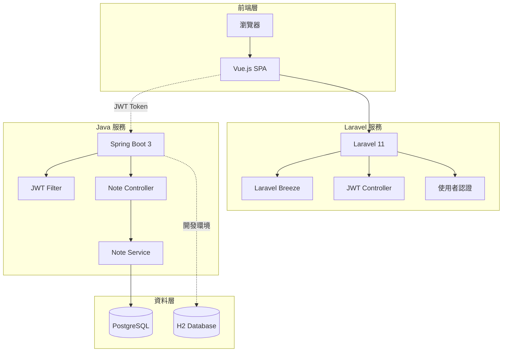
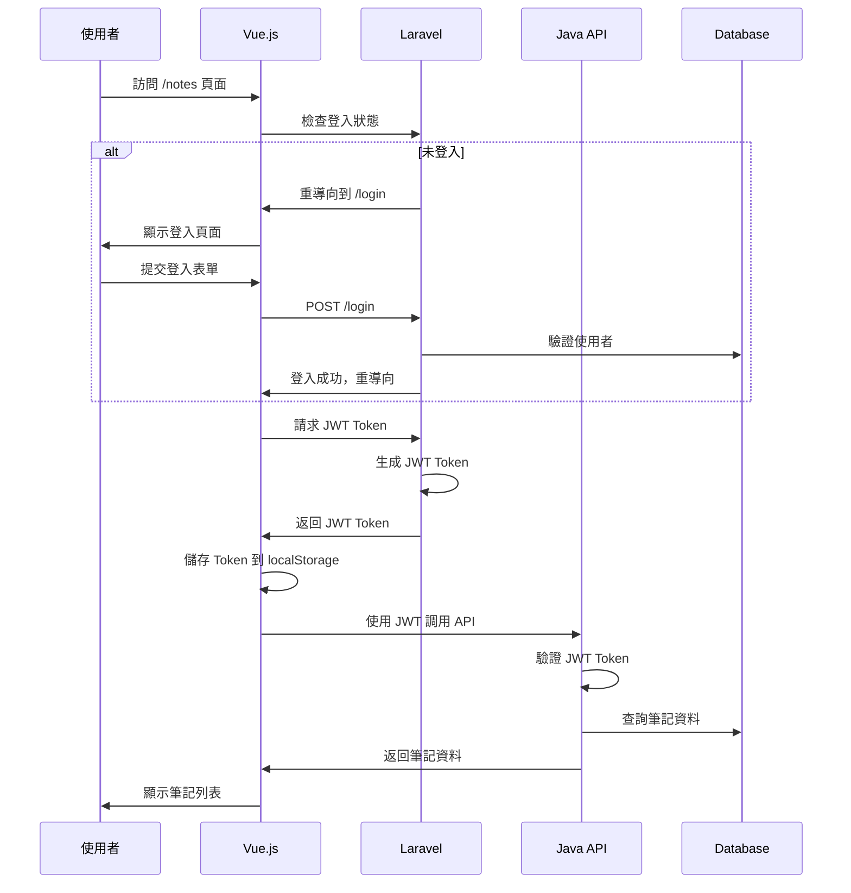
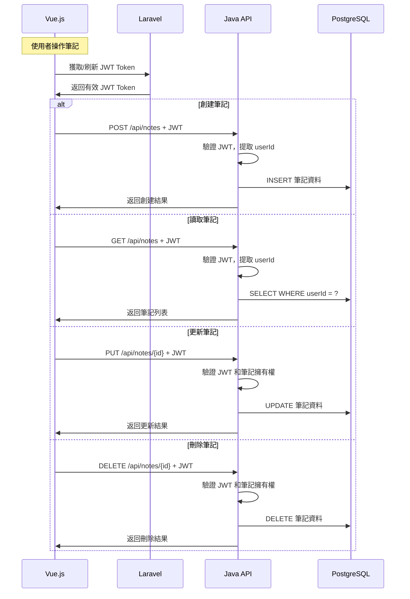

# 🏗️ Coffee Journal 系統架構文檔

## 📋 架構概覽

Coffee Journal 採用微服務架構設計，將前端認證與後端資料處理完全分離，通過 JWT Token 實現跨服務認證。



## 🔄 資料流程圖

### 使用者認證流程


### 筆記 CRUD 流程


## 🏛️ 服務架構詳解

### Laravel 前端服務

**職責範圍**:
- 🎨 **使用者介面**: Vue.js SPA 應用
- 🔐 **認證管理**: 註冊、登入、密碼重設
- 🎫 **JWT 簽發**: 為 Java 後端提供認證憑證
- 📱 **會話管理**: Web 會話和狀態管理

**技術組件**:
```
Laravel 11
├── Laravel Breeze (認證腳手架)
├── Inertia.js (SPA 橋樑)
├── Vue.js 3 (前端框架)
├── Tailwind CSS (樣式框架)
├── Vite (建構工具)
└── Firebase JWT (Token 處理)
```

**API 端點**:
- `POST /login` - 使用者登入
- `POST /register` - 使用者註冊
- `POST /api/jwt/token` - 生成 JWT Token
- `POST /api/jwt/verify` - 驗證 JWT Token
- `GET /api/user` - 獲取使用者資訊

### Java 後端服務

**職責範圍**:
- 📝 **資料管理**: 咖啡筆記 CRUD 操作
- 🔒 **JWT 驗證**: 驗證 Laravel 簽發的 Token
- 👤 **使用者隔離**: 確保資料安全性
- 📊 **業務邏輯**: 搜尋、統計、分析功能

**技術組件**:
```
Spring Boot 3
├── Spring Security (安全框架)
├── Spring Data JPA (資料存取)
├── JWT Library (Token 驗證)
├── PostgreSQL Driver (資料庫驅動)
├── H2 Database (開發環境)
└── Gradle (建構工具)
```

**API 端點**:
- `GET /api/notes` - 獲取筆記列表
- `POST /api/notes` - 創建筆記
- `PUT /api/notes/{id}` - 更新筆記
- `DELETE /api/notes/{id}` - 刪除筆記
- `GET /api/health` - 健康檢查

## 🔐 安全架構

### JWT 認證機制

**Token 生成** (Laravel):
```php
$payload = [
    'iss' => config('app.url'),      // 簽發者
    'aud' => 'coffeenote-api',       // 接收者
    'iat' => time(),                 // 簽發時間
    'exp' => time() + 86400,         // 過期時間
    'sub' => $user->email,           // 主題
    'userId' => $user->id,           // 使用者 ID
];
$token = JWT::encode($payload, $secret, 'HS256');
```

**Token 驗證** (Java):
```java
Claims claims = Jwts.parser()
    .verifyWith(getSigningKey())
    .build()
    .parseSignedClaims(token)
    .getPayload();
    
Long userId = claims.get("userId", Long.class);
```

### 資料安全

**使用者隔離**:
- 每個 API 請求都驗證 JWT Token
- 從 Token 中提取 `userId`
- 所有資料查詢都加上 `WHERE userId = ?` 條件

**權限控制**:
- Laravel: Web 會話 + Sanctum
- Java: JWT Token + Spring Security
- 資料庫: 行級安全性 (RLS)

## 🗄️ 資料架構

### 資料庫設計

**使用者表** (Laravel 管理):
```sql
CREATE TABLE users (
    id BIGSERIAL PRIMARY KEY,
    name VARCHAR(255) NOT NULL,
    email VARCHAR(255) UNIQUE NOT NULL,
    password VARCHAR(255) NOT NULL,
    email_verified_at TIMESTAMP,
    created_at TIMESTAMP,
    updated_at TIMESTAMP
);
```

**筆記表** (Java 管理):
```sql
CREATE TABLE coffee_notes (
    id BIGSERIAL PRIMARY KEY,
    bean_name VARCHAR(255) NOT NULL,
    origin VARCHAR(255),
    roast_level VARCHAR(255),
    flavor_notes TEXT,
    rating INTEGER CHECK (rating >= 1 AND rating <= 5),
    brewing_method VARCHAR(255),
    user_id BIGINT NOT NULL,
    created_at TIMESTAMP DEFAULT CURRENT_TIMESTAMP,
    updated_at TIMESTAMP DEFAULT CURRENT_TIMESTAMP,
    
    INDEX idx_user_id (user_id),
    INDEX idx_created_at (created_at)
);
```

### 資料同步策略

**使用者資料**:
- Laravel 為主要來源
- Java 通過 JWT Token 獲取使用者資訊
- 不在 Java 端儲存使用者敏感資料

**筆記資料**:
- Java 為主要來源
- 通過 REST API 提供資料存取
- 支援分頁、搜尋、統計功能

## 🚀 部署架構

### 開發環境
```
localhost:8000 (Laravel + Vue.js)
    ↓ JWT Token
localhost:8080 (Java Spring Boot)
    ↓
H2 Memory Database
```

### 生產環境
```
Load Balancer
    ├── Laravel Containers (Port 8000)
    └── Java Containers (Port 8080)
        ↓
PostgreSQL Cluster
```

### Docker 容器化
```yaml
services:
  backend-laravel:
    build: ./backend-laravel
    ports: ["8000:8000"]
    environment:
      - JWT_SECRET=shared_secret
      
  backend-java:
    build: ./backend-java
    ports: ["8080:8080"]
    environment:
      - JWT_SECRET=shared_secret
      
  postgres:
    image: postgres:15
    environment:
      - POSTGRES_DB=coffeenote
```

## 📊 效能考量

### 快取策略
- **Laravel**: Redis 會話快取
- **Java**: JPA 二級快取
- **前端**: JWT Token localStorage 快取

### 資料庫最佳化
- 適當的索引設計
- 查詢最佳化
- 連接池配置
- 讀寫分離 (未來)

### 監控指標
- API 響應時間
- 資料庫查詢效能
- JWT Token 驗證效能
- 記憶體使用率

## 🔮 未來擴展

### 微服務拆分
- 使用者服務 (Laravel)
- 筆記服務 (Java)
- 通知服務 (Node.js)
- 檔案服務 (Go)

### 技術升級
- API Gateway (Kong/Zuul)
- 服務發現 (Consul/Eureka)
- 分散式追蹤 (Jaeger)
- 訊息佇列 (RabbitMQ/Kafka)

### 功能擴展
- 即時通知
- 檔案上傳
- 社交功能
- 行動應用 API
